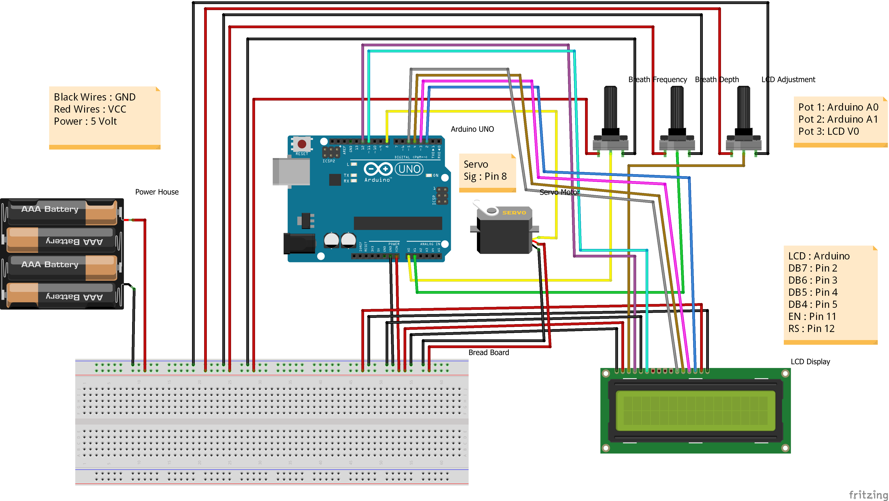
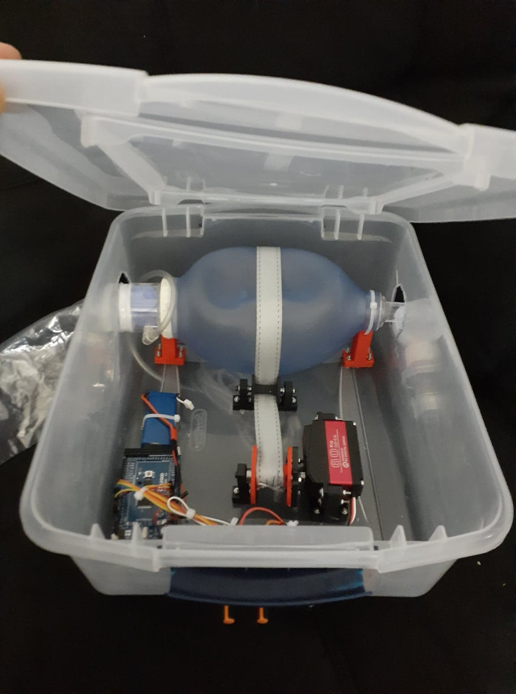

# Sukh Ka Saans
Open Source Mechanical Ventilator using Ambu Bag &amp; Arduino to help people struggling for medical aid in pandemic situations like COVID-19. It's low cost ($60-80) easy to make and use.\
It is strap based design which squeezes the bag with servo motor rotation and measures tidal volume with servo motor position.

# Schematics

# Components
1. Arduino 1  
2. Servo Motor (Metal Geared High torque) 1  
3. Servo Driver 1 (Optional)  
4. Ambu Bag 1 (Any Available, preferable medium or adult size)  
5. 16-2 LCD (Optional) 1  
6. Potentiometers 3 (10k or any other available)  
7. Voltage Regulator / Power Supply (To power Arduino, Servo and other components)  
8. Breadboard / Veroboard / PCB  

# Prototype

\
**Feel free for suggestions and modifications.**
